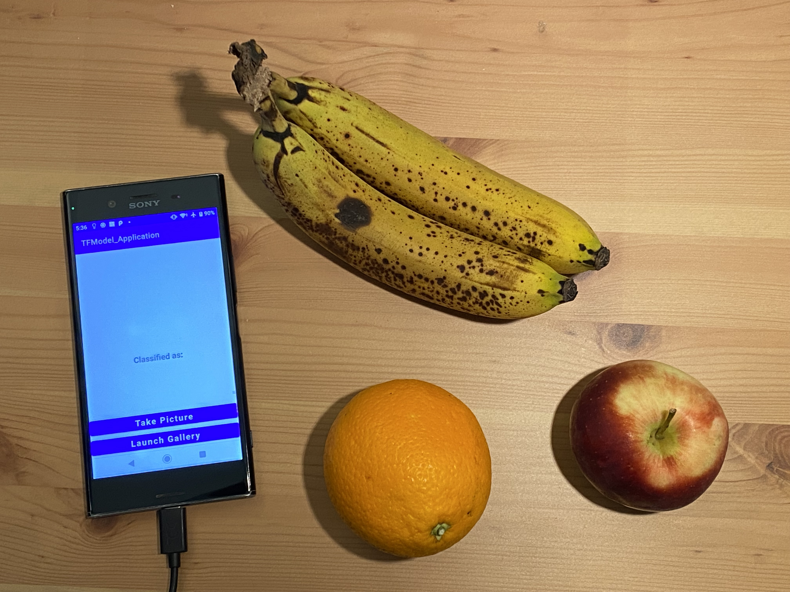
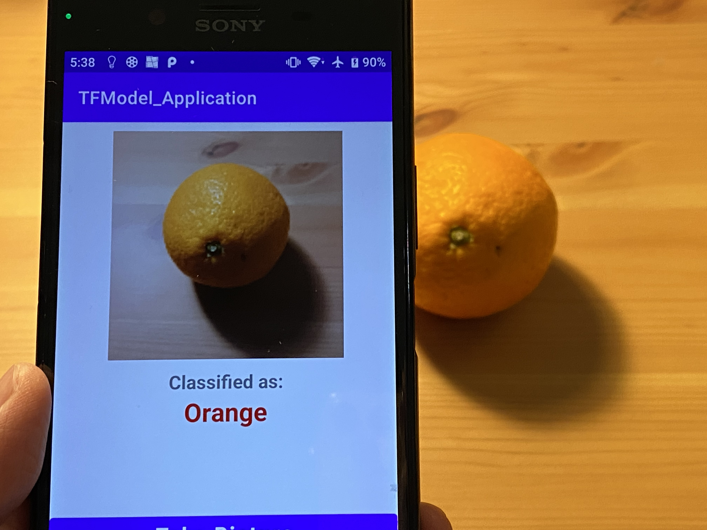
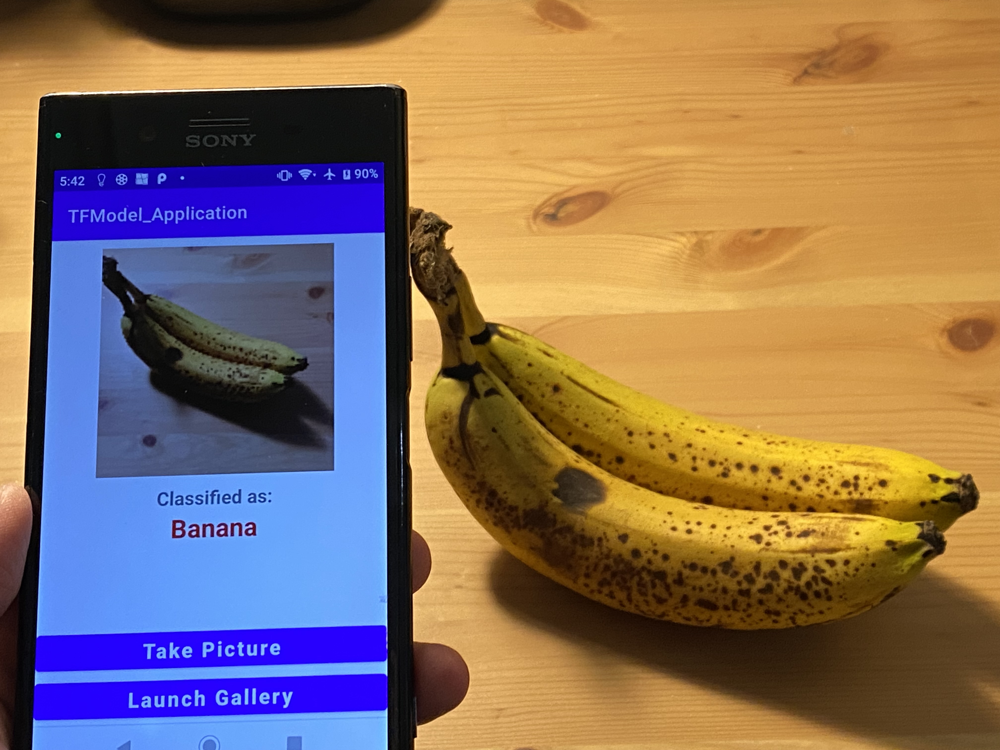

# Fruit Classifier Android App

## Introduction

This Android application, designed in Java and developed using Android Studio, leverages a custom-trained neural network to accurately classify three types of fruits: apples, oranges, and bananas. The neural network was trained on a diverse dataset using Python in Google Colab, ensuring robust and accurate classifications. Employing TensorFlow Lite for on-device inference, this app can classify these fruits in real-time using the camera or by analyzing images from the device's gallery.

## Key Features

- **Fruit Classification**: Recognizes apples, oranges, and bananas.
- **Real-Time Analysis**: Use your device's camera to identify fruits instantly.
- **Gallery Images**: Classify fruits from stored images.
- **User-Friendly Interface**: Easy to navigate and use.

## Installation and Usage

### Prerequisites

- Android Studio
- An Android device or emulator
- Basic understanding of Android app development

### Installation

1. Clone this repository to your local machine.
2. Open the project in Android Studio.
3. Configure your Android device or emulator to run the app.
4. Build and run the application.

### How to Use

- **Camera Access**: On opening the app, grant permission to access the camera. Point your device's camera at a fruit for instant classification.
- **Selecting from Gallery**: Navigate to the gallery section within the app, choose an image, and let the app classify the fruit.

## Demonstration

### Screenshots and Videos

*App ready for fruit classification test with an orange, apple, and banana.*
   

*Video showing successful classification of an apple.*
   

*Successfully classified an orange.*
   

*Successfully classified a banana.*
   

*Video showing the app successfully classifying different fruit images from the gallery.*

## Development

- **Model Training**: The neural network model was trained using Python in Google Colab. [View the training notebook](https://colab.research.google.com/drive/1RDo21PMJngn8lv7i8ol-SuOC0HDA2NgG?usp=sharing).
- **Application Development**: The application was developed in Java using Android Studio. It integrates TensorFlow Lite for on-device model inference.

